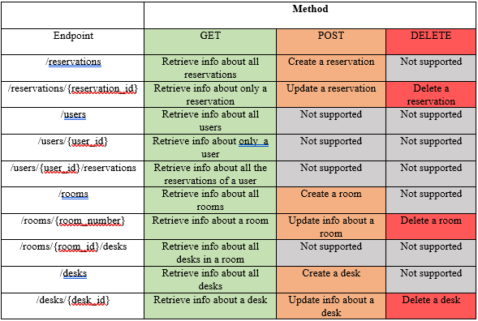
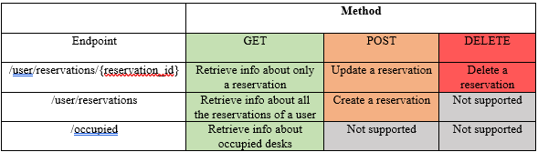
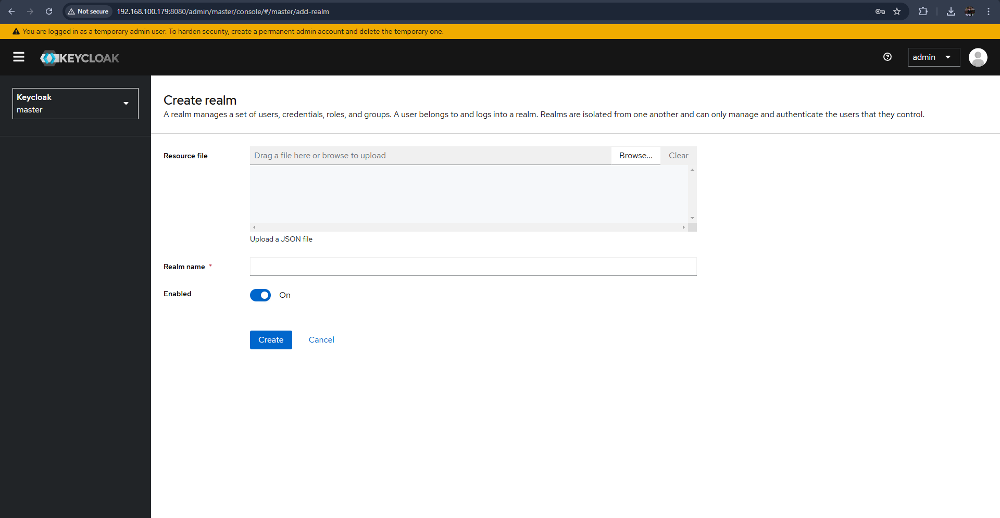
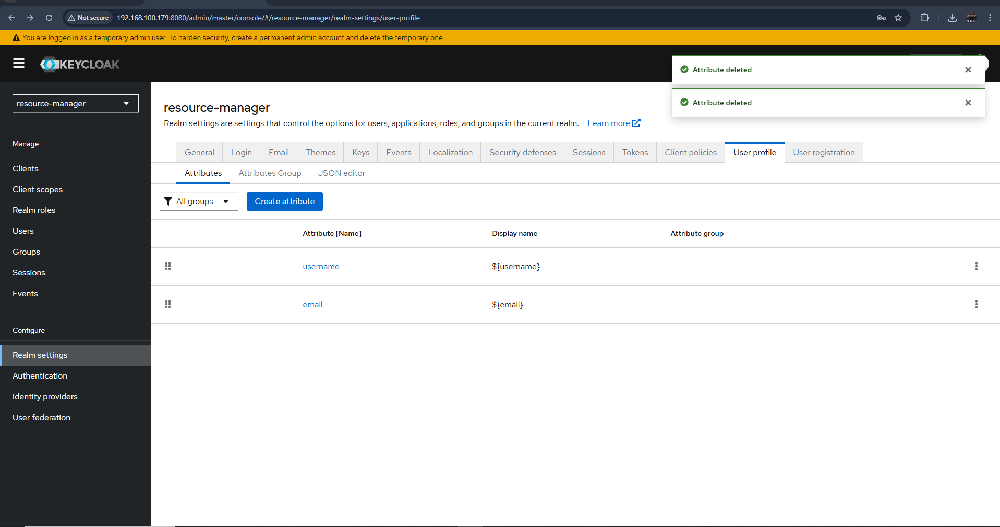
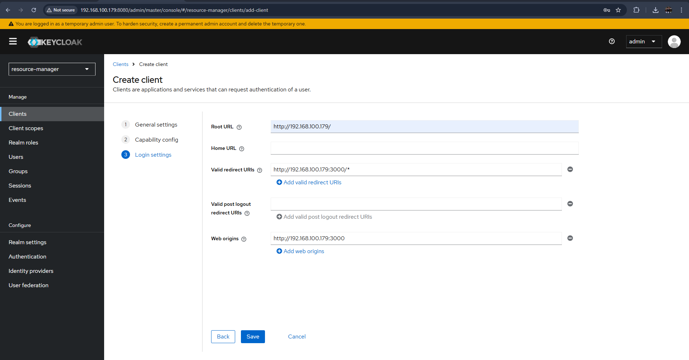
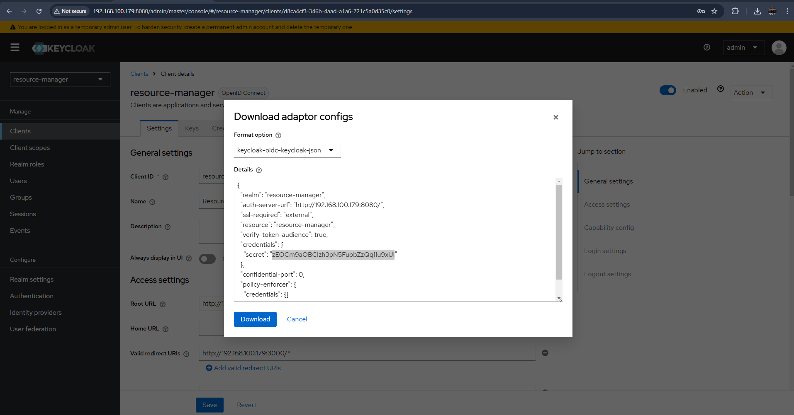
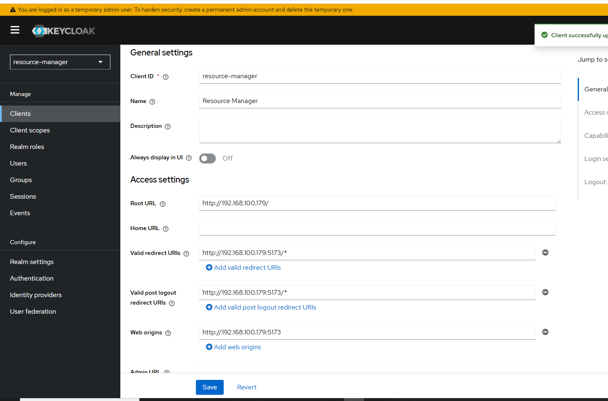
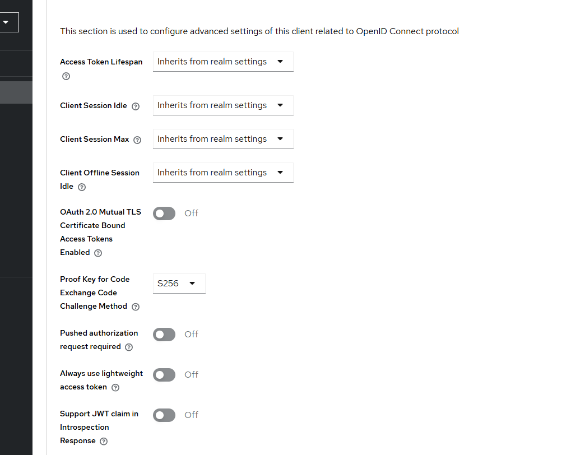

# Resource Manager

The project focuses on developing a "Resource Manager" application for managing shared resources such as meeting rooms or laboratory equipment.

# Repo setup for development
```
git clone REPO
git branch dev
git checkout dev
git push -u origin dev
```
# <i>Backend</i>

# Project setup
```
cd backend
npm init -y
npm install # Installs all dependencies from package.json
```

Run with `npm run dev`

# Database setup
Postgres database should initially be ran with docker using:
`docker run -d --name app-db -e POSTGRES_USER="whatever" -e POSTGRES_PASSWORD="whatever" -e POSTGRES_DB="resource-manager" -p 5432:5432 postgres:latest`

Credentials will be read from a `.env` file which must be created in the `backend/` directory and should have the following fields:
```
DB_HOST=localhost
DB_PORT=5432
DB_USER=USERNAME
DB_PASS=PASSWORD
DB_NAME=resource-manager

APP_SECRET=secret
APP_URL="http://IP"

TEST_USER="tester"
TEST_USER_PASS=whatever

KEYCLOAK_REALM="resource-manager"
KEYCLOAK_CLIENT="resource-manager"
KEYCLOAK_URL="http://localhost:8080/" #Or the IP of the development machine
```

>The user which will access Keycloak via admin-cli must have view-users role assigned

Create tables and use dummy data:
```
cd database
npx sequelize-cli db:migrate # Migration
npx sequelize-cli db:seed:all # Dummy data
```

# Summary of the API endpoints of the app and their purpose

>Admin endpoints


>User endpoints


# Authentication server setup
1. Make sure the .env file has all the proper fields

2. Docker command to run Keycloak
```
docker run -d --name keycloak -p 8080:8080 -e KC_BOOTSTRAP_ADMIN_USERNAME=admin -e KC_BOOTSTRAP_ADMIN_PASSWORD=admin quay.io/keycloak/keycloak:26.1.0 start-dev
```
3. Go to http://IP:8080
4. Login with admin credentials
5. Create new realm called `resource-manager`



6.  Then modify the info needed for register/login: Go to Realm settings > User Profile > Delete lastName and firstName



7. Create two realm roles: admin and user
8. Creating `resource-manager` client
* Client authentication and Authorization enabled
* Add the IP address of your development server or if localhost(depends on the case)



9. Create a client scope called `resource-manager`, then add a mapper to that scope which has the `Included Client Audience` as `resource-manager`
10. Add the scope to the `resource-manager` Client
11. Get the secret key from the adapter config of the client and add it to the .env file 



12. Add realm and client role mappers to the `resource-manager` client scope and enable to be added to userinfo. In this way we can see their roles in the access token. 
13. Add the `view-users` role to the admin role and the `user` role to the defaults role.
14. Create a user and assign him admin and user roles, then test the `/admin` and `/user` endpoints.

# Testing approach

Every endpoint will be tested based on the methods that it supports. I recommend that firstly the admin endpoints are tested in this order: GET, POST, DELETE, then the user ones in the same order.

A "tester" user has to be created in Keycloak and his info must be added to the .env file. He will be assigned the admin and user role so that he can access all the endpoints.

The files containing get "*TestGet.js" are used to test if the endpoints are accessible and if theyr return the proper code.

The files containing post "*TestPost.js" are used to either created or update resources, expecting either code 201 or code 200, respectively. At the moment, the resources aren't created on behalf of user "tester", but as a preexisting user with his email addresses hardcoded.(this is temporary)

The files containing delete "*TestDelete.js" are used to test if the resources can be deleted correctly and if the return code is the proper one.

The commands used to test are simple:
```
cd backend/testing

sudo apt install mocha chai -Y

npx mocha 'testfile'
```
Run this command in the order specified above for every file.

# <i>Frontend</i>

# Frontend Framework setup

```
npm create vite@latest frontend
cd frontend
npm install
npm run dev
```

Create .env file in /frontend and add environment variables as follows:
```
VITE_KEYCLOAK_REALM="resource-manager"
VITE_KEYCLOAK_CLIENT="resource-manager"
VITE_KEYCLOAK_URL="http://localhost:8080" #Or the IP of the development machine
VITE_BACKEND_API_URL="http://localhost:3000" #Or the IP of the development machine

VITE_REQUIRED_ROLE="Admin"
```
# Redoing keycloak setup for frontend
1. Change URLs to the frontend ones in Keycloak for redirects



Web origins will remain like this for now.

2. In Advanced settings, change PKCE like in the photo



# Testing
For testing purposes, add:
```
test: {
    environment: 'jsdom',
    globals: true,
    setupFiles: './src/testing/setup.js',
}
```
in `vite.config.js` plugins array.

Also, add:
`"test": "vitest"`
in `package.json` scripts objects.

Then, run in frontend folder `npx vitest` or `npm run test`.

# <i>Dockerization</i>

There are 2 compose files, one for local deployment and one for swarm deployment

Docker command for initial setup

```
docker swarm init --advertise-addr <IP>

docker service create --name registry --publish published=5000,target=5000 registry:2

docker build -t desk-manager-backend:latest backend/
docker build -t desk-manager-frontend:latest frontend/

docker tag desk-manager-backend:latest localhost:5000/desk-manager-backend:latest
docker tag desk-manager-frontend:latest localhost:5000/desk-manager-frontend:latest

docker push localhost:5000/desk-manager-backend:latest
docker push localhost:5000/desk-manager-frontend:latest

docker network create --driver overlay desk-manager-stack

Create secrets
echo "your_db_name" | docker secret create pg_db_name -
echo "your_db_user" | docker secret create pg_db_user -
echo "your_db_pass" | docker secret create pg_db_pass -

docker stack deploy -c docker-compose-stack.yml desk-manager
```

Commands for management
```
docker service ls

docker service logs <NAME>

docker network ls
```
# <i>K3s Deployment</i>

Create cloudflare-secret.yaml
```
apiVersion: v1
kind: Secret
metadata:
  name: cloudflare-key
  namespace: cert-manager
type: Opaque
stringData:
  api-token: key
```